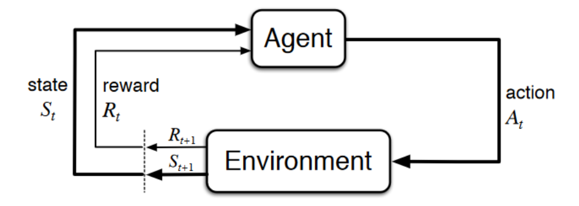
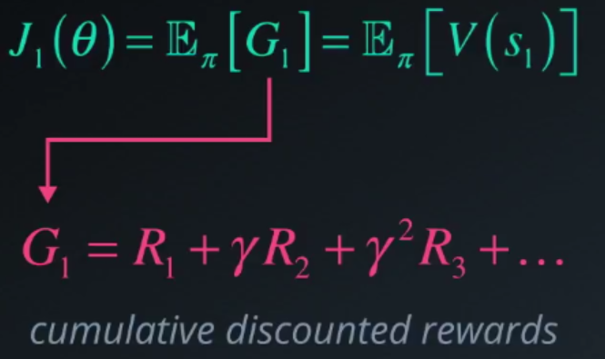
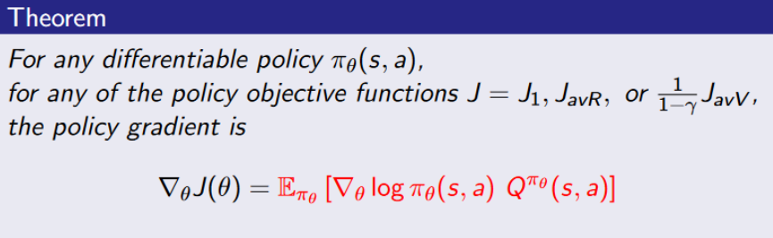
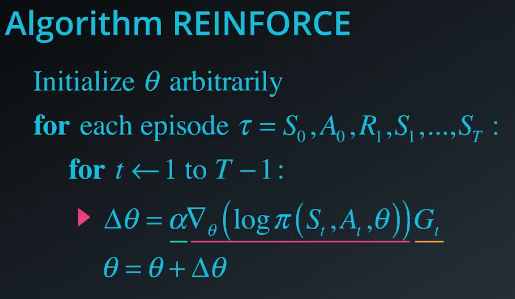

# Policy-Gradient-Doom 🎮

In this notebook, we will create a Policy Gradient based agent that tries to survive in an hostile environement by collecting health.
 
We will use Policy Gradient with Baseline method <b>which is an approach to design the policy gradient algorithm</b>

Our agent after 400 epochs:

  
## Aknowledgements
Our implementation will be inspired by this tutorial:
https://www.oreilly.com/ideas/reinforcement-learning-with-tensorflow

## A recap: Reinforcement Learning Process 🎮

Reinforcement Learning: is when an agent learns by interacting with the environement itself (through trial and error) it receives reward when performing correct actions. It's a decision making problem.

 
The Reinforcement Learning loop:

- Agent receive state S0 from the environment
- Based on that state S0 agent take an action A0
- Environnement transitions to a new state S1
- Give some reward R1 to the agent
 
 
→ This output a sequence of state, reward and action. 
→ The goal of the agent <b>is maximize expected cumulative reward in order to reach an optimal policy (way to behave).</b>

### Recap: What is policy gradient? 🤖

- Policy Gradient is a policy based reinforcement learning method: in this method, we want <b>to directly to learn an π* by optimize it without worrying about a value function, we’ll directly parameterize the π and do gradient descent into a direction that improves it.</b>
  
- Why? Because it's sometimes easier to approximate than the value function. Also, we need a parameterized policy to deal with continuous action spaces and environments where we need to act stochastically.
  
- Common choices for the policy function: Softmax for discrete actions, Gaussian parameters for continuous actions.
  
- To measure the quality of π, we calculate the objective/score function `J(theta)` : we can use 3 differents methods: start value, average value, or average reward per time step. In our case by calculating the maximum expected cumulative reward (we can use the start value : use the mean of the return from the first time step (G1) == cumulative discounted reward for the entire episode).
 

 
 
- Then, we have an objective function. Now, we want to find a π that max it. We Using gradient ascent by computing the gradients analytically: Policy Gradient Theorem: `grad(J(theta)) = Ex[grad(log(pi(s, a))) * Q(s, a)]`. Basically, we move our policy into a direction of more reward.
 

 
 
- REINFORCE (Monte Carlo Policy Gradient): We substitute a samples return `g_t` form an episode for Q(s, a) to make an update. Unbiased but high variance.

  
    For each episode:
        At each time step within that episode:
            Compute the log probabilities produced by our policy function.
            Multiply it by the score function.
            Update the weights with some small learning rate alpha
           

## Policy Gradients with Baseline method 👾
- Baseline: Instead of measuring the absolute goodness of an action we want to know how much better than "average" it is to take an action given a state. E.g. some states are naturally bad and always give negative reward. This is called the advantage and is defined as `Q(s, a) - V(s)`. We use that for our policy update, e.g. `g_t - V(s)` for REINFORCE.
